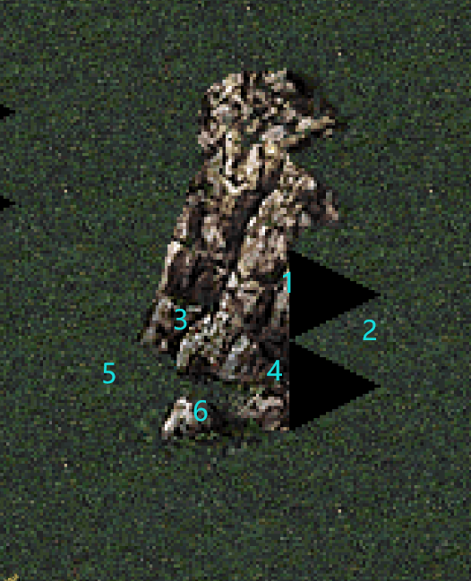

# 地形素材的引用

```yaml
	Template@test:
		Categories: ZZZ Test Cliff Set 
		Id: 835
		Images: clifftest01.shp
		Size: 2, 3
		Tiles:
			0: Cliff  #地块表面类型
				Height: 4 #地块高度
				MinColor: 574C41 #地块雷达颜色1
				MaxColor: 574C41 #地块雷达颜色2
				ZOffset: 15 #地块Z向坐标，影响遮盖
				ZRamp: 0 #影响遮盖的一个值，一般为0表示在底层
			2: Cliff
				MinColor: 65584D
				MaxColor: 65584D
				ZOffset: 15
				ZRamp: 0
			3: Cliff
				Height: 4
				MinColor: 5D5146
				MaxColor: 5D5146
				ZOffset: 15
				ZRamp: 0
			5: Cliff
				MinColor: 4F4B3C
				MaxColor: 4F4B3C
				ZOffset: 15
				ZRamp: 0
````


ora可使用shp作为地形素材，观察上述代码与下面的图片。:
- `Categories: ZZZ Test Cliff Set ` 表示地形块在地图编辑器中的分类，你可以随便起名，此项同名的地形块会归类在一起。
- `Id: 835` 不可重复的唯一值
- `Images: clifftest01.shp`引入的地形素材
- `DepthImages: ` 地形素材的深度素材，如果没有使用此项，默认为空。当它为空时，将会使用Image序列的后半段作为深度图
- `Size: 2, 3` 地形占地为2*3 每个单元格对应Image的对应帧数如下图所示
- `Tiles:` 对每个单元格地块进行设置



- 本例素材为12帧，前6帧对应6个地块，其中第2帧和第5帧为空，参考上面的游戏内效果图。后6帧对应为深度图，本例没有使用深度图，因此留空。
    

- 上面还有没有讲到的一个属性：
```yaml
	Template@510: #斜坡实例
		Categories: Ramp edge fixup
		Id: 510
		Images: rmpfx01.tem, rmpfx01a.tem, rmpfx01b.tem, rmpfx01c.tem #是的，可以使用tmp素材，不过问题有点多，这里多个素材表示随机使用这些素材，应该是在地图加载时确定随机使用哪一个。
		Size: 1, 1
		Tiles:
			0: Clear
				RampType: 1 #斜坡类型，一共20种，取值1-20
				MinColor: 334131
				MaxColor: 334131
				ZOffset: -15
				ZRamp: 0 
```